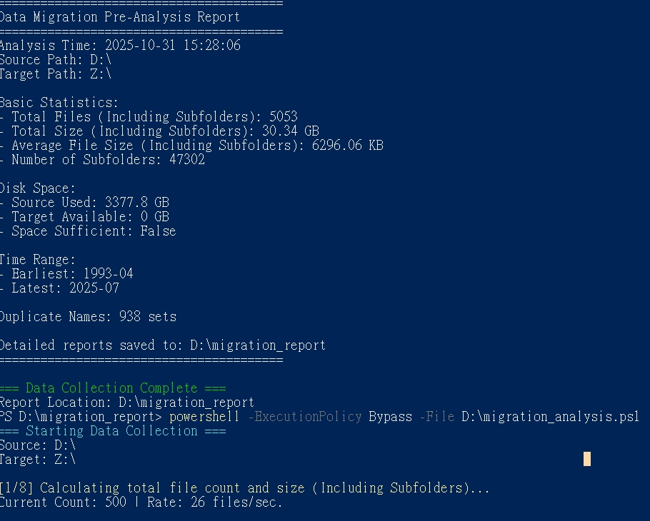

# Migration Analysis Script

## English

### Description

This PowerShell script (`migration_analysis.ps1`) is designed to perform a pre-analysis of data before a migration. It scans a source directory, gathers metadata and statistics about the files within, and generates a series of reports to help plan and execute the migration smoothly.

### Features

-   **Basic Statistics**: Calculates the total count, total size, and average size of all `.csv` files in the source path.
-   **Folder Structure Analysis**: Lists all subdirectories to understand the complexity of the folder hierarchy.
-   **File Sampling**: Exports metadata for the first 1000 `.csv` files found.
-   **Date Distribution**: Groups files by their last modification date (Year-Month) to show data age.
-   **Size Distribution**: Categorizes files into different size buckets.
-   **Disk Space Check**: Compares the used space on the source drive with the free space on the target drive to ensure sufficiency.
-   **Duplicate Filename Detection**: Identifies files with identical names that might cause conflicts during migration.
-   **Summary Report**: Generates a text file summarizing all the key findings.

### Output

The script creates a `migration_report` directory on the `D:\` drive, containing several `.csv` files with detailed analysis and a `summary.txt` file.

### How to Run

Open a PowerShell terminal and execute the following command. Remember to replace the file path with the actual location of the script if it's different.

```powershell
powershell -ExecutionPolicy Bypass -File "D:\\migration_analysis.ps1"
```

### **Risk Warning**

*   **Hardcoded Paths:** The script is configured to read from `D:\` and check against `Z:\`. It also writes its report folder to `D:\migration_report`. If these drives do not exist or are not the intended paths, the script will fail.
*   **System Performance:** The script scans the entire `D:\` drive, which can be very time-consuming and resource-intensive, potentially slowing down your system during execution.
*   **File System Write Access:** The script will create a directory at `D:\migration_report`. Ensure that you have the necessary permissions to write to the `D:\` drive.
*   **Execution Policy Bypass:** Using `-ExecutionPolicy Bypass` disables security protections for this command. Only run scripts from trusted sources.

---
## 中文 (Traditional Chinese)

### 描述

這個 PowerShell 腳本 (`migration_analysis.ps1`) 用於在資料遷移前執行預先分析。它會掃描來源目錄，收集其中檔案的元數據和統計資訊，並產生一系列報告，以幫助順利規劃和執行遷移。

### 功能

-   **基本統計**: 計算來源路徑中所有 `.csv` 檔案的總數量、總大小和平均大小。
-   **資料夾結構分析**: 列出所有子資料夾，以了解資料夾層次的複雜性。
-   **檔案抽樣**: 導出找到的前 1000 個 `.csv` 檔案的元數據。
-   **日期分佈**: 根據檔案的最後修改日期（年月）進行分組，以顯示資料的時效性。
-   **大小分佈**: 將檔案分類到不同的大小區間。
-   **磁碟空間檢查**: 比較來源磁碟的已用空間與目標磁碟的可用空間，以確保空間充足。
-   **重複檔名偵測**: 識別具有相同名稱的檔案，這些檔案可能會在遷移過程中引起衝突。
-   **總結報告**: 產生一個文字檔案，總結所有關鍵發現。

### 輸出

該腳本會在 `D:\` 磁碟機上建立一個名為 `migration_report` 的目錄，其中包含數個詳細的 `.csv` 分析報告和一個 `summary.txt` 檔案。

### 如何運行

打開 PowerShell 終端並執行以下命令。如果腳本的實際位置不同，請記得替換文件路徑。

```powershell
powershell -ExecutionPolicy Bypass -File "D:\\migration_analysis.ps1"
```

### **風險警告**

*   **硬編碼路徑:** 腳本被設定為從 `D:\` 讀取並與 `Z:\` 進行核對。它還會將報告資料夾寫入 `D:\migration_report`。如果這些磁碟機不存在或不是預期的路徑，腳本將會失敗。
*   **系統性能:** 腳本會掃描整個 `D:\` 磁碟機，這可能會非常耗時且佔用大量資源，在執行期間可能會降低您的系統速度。
*   **檔案系統寫入權限:** 腳本將在 `D:\migration_report` 建立一個目錄。請確保您具有寫入 `D:\` 磁碟機的必要權限。
*   **執行策略繞過:** 使用 `-ExecutionPolicy Bypass` 會為此命令禁用安全保護。請僅運行來自可信來源的腳本。

---
## 日本語 (Japanese)

### 説明

このPowerShellスクリプト (`migration_analysis.ps1`) は、データ移行前に事前分析を実行するために設計されています。ソースディレクトリをスキャンし、ファイルに関するメタデータと統計情報を収集し、移行をスムーズに計画・実行するためのレポートを生成します。

### 機能

-   **基本統計**: ソースパス内のすべての `.csv` ファイルの総数、合計サイズ、平均サイズを計算します。
-   **フォルダ構造分析**: すべてのサブディレクトリをリストアップし、フォルダ階層の複雑さを理解します。
-   **ファイルサンプリング**: 最初に見つかった1000個の `.csv` ファイルのメタデータをエクスポートします。
-   **日付分布**: ファイルを最終更新日（年月）でグループ化し、データの古さを示します。
-   **サイズ分布**: ファイルを異なるサイズのカテゴリに分類します。
-   **ディスク容量チェック**: ソースドライブの使用済み容量とターゲットドライブの空き容量を比較し、十分なスペースがあるか確認します。
-   **重複ファイル名検出**: 移行中に競合を引き起こす可能性のある、同じ名前のファイルを特定します。
-   **サマリーレポート**: すべての主要な分析結果をまとめたテキストファイルを生成します。

### 出力

スクリプトは `D:\` ドライブに `migration_report` というディレクトリを作成し、その中に詳細な分析が記載された複数の `.csv` ファイルと `summary.txt` ファイルを格納します。

### 実行方法

PowerShellターミナルを開き、以下のコマンドを実行します。スクリプトの実際の場所が異なる場合は、ファイルパスを置き換えることを忘れないでください。

```powershell
powershell -ExecutionPolicy Bypass -File "D:\\migration_analysis.ps1"
```

### **リスク警告**

*   **ハードコードされたパス:** スクリプトは `D:\` から読み取り、`Z:\` と照合するように設定されています。また、レポートフォルダを `D:\migration_report` に書き込みます。これらのドライブが存在しないか、意図したパスでない場合、スクリプトは失敗します。
*   **システムパフォーマンス:** スクリプトは `D:\` ドライブ全体をスキャンするため、非常に時間がかかり、リソースを大量に消費する可能性があり、実行中にシステムの速度が低下する可能性があります。
*   **ファイルシステムへの書き込みアクセス:** スクリプトは `D:\migration_report` にディレクトリを作成します。`D:\` ドライブへの書き込みに必要な権限があることを確認してください。
*   **実行ポリシーのバイパス:** `-ExecutionPolicy Bypass` を使用すると、このコマンドのセキュリティ保護が無効になります。信頼できるソースからのスクリプトのみを実行してください。

---



---

**Disclaimer:** This script is provided "as is" with no copyright. Use at your own risk.

**免責聲明:** 此腳本按“原樣”提供，沒有版權。使用風險自負。

**免責事項:** このスクリプトは「現状有姿」で提供され、著作権はありません。ご自身の責任でご使用ください。


